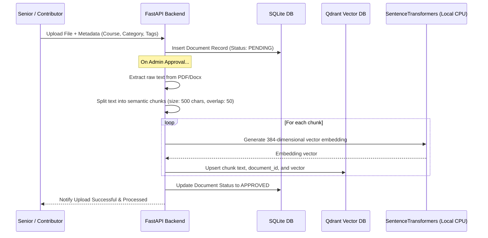
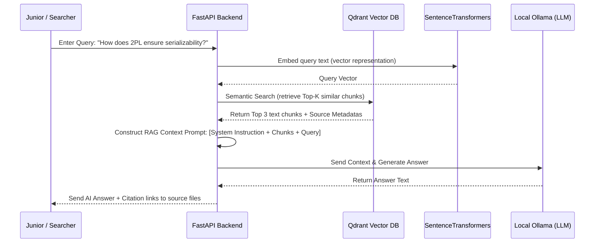

# Acadence AI - Frontend Design, Workflow, and RAG Engineering Details

This document outlines the detailed frontend layout, user workflows, evaluation metrics for RAG accuracy, and engineering principles that elevate "Acadence AI" to a high-scoring, production-ready final-year computer science project.

---

## 1. Frontend Pages & UI Content

We will design a responsive single-page application (SPA) with a navigation sidebar. The interface will feature a dark-themed, glassmorphic layout (semi-transparent backdrops, subtle gradients, and smooth hover micro-animations) to feel premium and modern.

### A. Authentication Page (`/login` / `/signup`)
*   **UI Content**:
    *   Glassmorphic auth card centering the screen with a subtle neon radial gradient background.
    *   Simple email & password input fields with client-side form validation.
    *   Role Selector dropdown: *Junior (Searcher)* or *Senior (Contributor)*.
    *   Toggle between "Sign In" and "Create Account".
*   **Engineering Note**: Local sessions are managed using standard JSON Web Tokens (JWT) stored securely in `localStorage` or HttpOnly cookies.

### B. Main Search & AI Chat Dashboard (`/` or `/search`)
This is the primary workspace where juniors query the system.
*   **UI Content**:
    *   **Search Section**: A prominent, central search bar with an auto-suggest dropdown for courses (e.g., *CS301 - Database Systems*).
    *   **Toggle Switch**: Switch between **Classic Keyword Search** (filters documents by title/tags) and **AI semantic Q&A** (activates chatbot).
    *   **AI Chat Interface (Split Pane or Sidebar)**:
        *   An interactive message history showing chat bubbles for user queries and AI responses.
        *   **Citations Box**: A list of source documents used to answer the question, with links to view the exact referenced text chunk.
        *   Typing indicator and a "Regenerate Answer" button.
    *   **Document Grid**: Search results displayed as clean cards showing:
        *   Document Title, Course Code, and Author (Senior Name).
        *   Upvote counter, date uploaded, and difficulty rating badge.
        *   "Download PDF" button.

### C. Contributor Upload Dashboard (`/upload`)
Accessible to Seniors and Admins.
*   **UI Content**:
    *   **Drag-and-Drop Area**: File uploader supporting `.pdf`, `.docx`, `.txt`, and `.md`.
    *   **Metadata Input Form**:
        *   Course selection dropdown (connected to backend DB).
        *   Professor Name, Academic Semester/Year.
        *   Category Tag (Notes, Labs, Placement, Exam Prep, Projects).
        *   Manual tags field (comma-separated).
    *   **Uploaded History Table**: Shows the list of files uploaded by the logged-in senior, their moderation status (*Pending*, *Approved*, *Rejected*), and total upvotes received.

### D. Leaderboard & Profile (`/leaderboard`)
Gamifies knowledge sharing to encourage seniors to contribute.
*   **UI Content**:
    *   **Top Contributors Ranking**: Clean table displaying ranks (1st, 2nd, 3rd with gold/silver/bronze icons), Senior names, department, number of approved documents, and total karma points (calculated from upvotes).
    *   **User Stats Dashboard**: Displays the logged-in user's stats: Total contributions, total downloads, and upvote ratio.

### E. Admin Moderation Panel (`/admin`)
Visible only to users with the Admin/Moderator role.
*   **UI Content**:
    *   **Pending Queue**: List of uploaded documents awaiting review. Admins can click "View/Read" (opens PDF previewer) and click "Approve" or "Reject".
    *   **Flagged Content list**: Documents flagged by juniors as inaccurate, poor quality, or plagiarized.
    *   **User Management Table**: Quick dashboard to promote a Junior to Senior or block/ban accounts.

---

## 2. Dynamic Workflows (Sequence of Actions)

### A. The Document Ingestion & Chunking Workflow
When a senior uploads a document, the backend processes it asynchronously:

### B. The Retrieval-Augmented Generation (RAG) Query Workflow
When a junior asks a question:

---

## 3. RAG Accuracy Level & System Efficiency

### When does local RAG become efficient?
A RAG system becomes efficient and practical when:
1.  **Fast Retrieval Speed**: The embedding search inside Qdrant takes **<15ms**, which is instantaneous on standard consumer CPUs because we use a small, dense embedding model (`all-MiniLM-L6-v2`).
2.  **Streaming Answers**: To make it feel fast, we stream the output token-by-token from Ollama so the student doesn't wait 10 seconds for the full response to generate.
3.  **Low Local Memory Footprint**: The entire system runs comfortably on a laptop with **8GB to 16GB RAM**. `all-MiniLM-L6-v2` uses only ~120MB RAM, SQLite is virtually zero, Qdrant local uses ~100MB, and Ollama running `gemma2:2b` or `llama3.2` uses ~2.5GB RAM.

### How to measure and optimize RAG accuracy?
To secure top marks in a project presentation, you should discuss and implement metrics that measure **Retrieval** and **Generation** performance.

| Stage | Metric Name | What it Measures | Target Range | How to Optimize |
|---|---|---|---|---|
| **Retrieval** | **Context Precision** | Out of the retrieved chunks, how many are actually relevant? | > 85% | Tune chunk size and chunk overlap; use semantic chunking. |
| **Retrieval** | **Context Recall** | Did we retrieve all the information needed to answer the question? | > 90% | Increase $K$ (number of chunks retrieved) from 3 to 5. |
| **Generation**| **Faithfulness / Groundedness**| Is the AI's answer based *only* on the retrieved chunks, or is it hallucinating? | > 95% | Strict system prompt instructions: *"If the context does not contain the answer, say 'I don't know'."* |
| **Generation**| **Answer Relevance** | Does the generated response directly address the user's question? | > 90% | Improve prompt templates with clear formatting guidelines. |

---

## 4. What makes this a "Good Engineered Project" for a CS Thesis?

Judges and professors look for rigorous engineering over basic API wrapper scripts. Here is how Acadence AI excels:

1.  **Zero-Cost Offline Architecture**: Demonstrates the ability to deploy AI pipelines locally, making the app highly secure, free to run, and air-gapped.
2.  **Hybrid Search Mechanics**: Instead of just using vector embeddings (which can miss specific course keywords like "CS301 exam"), the search service can combine:
    *   **SQL-based Metadata filter** (e.g. searching only under "Database Systems" notes).
    *   **Vector Semantic search** (for finding conceptual answers).
3.  **In-Process Vector Indexes**: Utilizing an in-process local instance of Qdrant shows sophisticated engineering by packaging database layers inside the application without heavy infrastructure dependencies.
4.  **Citations & Grounding**: Solves the core LLM hallucination problem. The backend links every statement in the chatbot response to a specific chunk hash, showing the junior user exactly where to read further in the original document.
5.  **Strict Security Practices**: Implements JWT authentication, password hashing with bcrypt, role-based access control (RBAC), and sanitizes text parsed from user files to prevent prompt injection.
